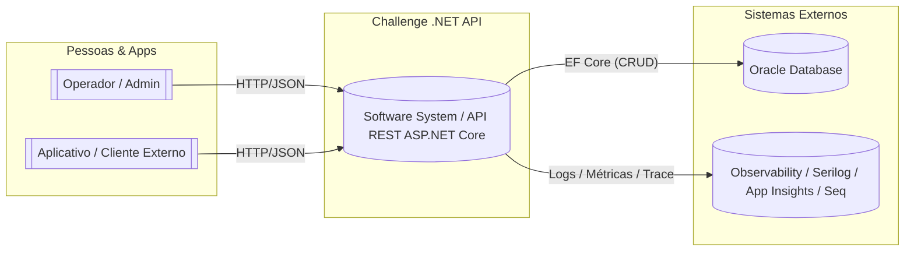
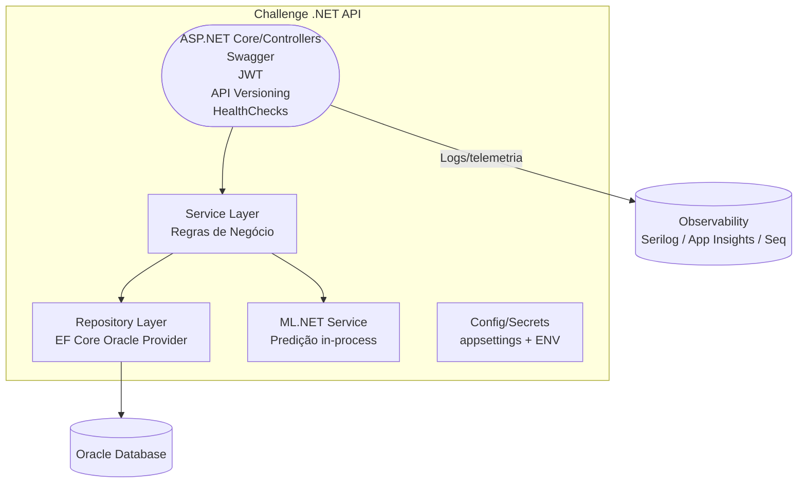

# Challenge .NET API 

Este projeto se trata de uma API RESTful desenvolvida voltada para o rastreamento e gestão inteligente de motos em pátios da empresa **MOTTU**. A solução propõe um sistema automatizado que utiliza visão computacional com marcadores ArUco e trilateração para determinar posições precisas das motos em tempo real.

## Descrição do Projeto

A ausência de um sistema automatizado de mapeamento e localização das motos compromete a agilidade da operação nos pátios da empresa MOTTU e aumenta o risco de falhas humanas.

Este projeto propõe uma solução tecnológica que visa melhorar a eficiência operacional por meio de:

- Cálculo preciso da posição das motos por trilateração, com base em distâncias medidas entre marcadores ArUco fixos e móveis instalados no ambiente (fixos) e nos veículos (móveis);
- Armazenamento e rastreamento histórico de posições para auditoria e controle de movimentação;
- Integração via API RESTful desenvolvida com ASP.NET Core e Entity Framework Core, seguindo boas práticas de arquitetura, documentação (Swagger/OpenAPI) e uso de DTOs.

**Público-alvo:** Funcionários responsáveis pela gestão de pátios da MOTTU

A API será consumida por uma aplicação móvel voltada aos operadores dos pátios, que permitirá:

- Visualização de um mapa digital com as posições em tempo real das motos;
- Consulta interativa: ao clicar sobre uma moto no mapa, o app exibe suas informações detalhadas (placa, modelo, status, histórico de localização etc.)

---

## Tecnologias Utilizadas

- ASP.NET Core 8 (Controllers)
- Entity Framework Core
- Oracle Database (via Oracle EF Core Provider)
- Swagger (OpenAPI 3)
- Docker (em desenvolvimento)
- **JWT (JSON Web Token)**
- **API Versioning**
- **ML.NET**
- **xUnit + WebApplicationFactory (Testes)**
- Git e GitHub

---

## Instalação e Execução

1. Clone o repositório:
    ```bash
    git clone https://github.com/thiag0renatino/challenge-dotnet-api
    ```
2. Acesse o diretório do projeto:
    ```bash
    cd challenge-dotnet-api
    ```
3. Configure a connection string no `appsettings.json` para o banco Oracle.

   Exemplo de configuração:
   ```json
   {
   "ConnectionStrings": {
     "DefaultConnection": "User Id=seu-id;Password=sua-senha;Data Source=oracle.fiap.com.br:1521/orcl"
   },
   "Jwt": {
    "Issuer": "ChallengeApi",
    "Audience": "ChallengeClients",
    "PrivateKey": "CRIE-SUA-KEY-16-CARACTERES"
      }
   }

   ```
   > Substitua `seu-id` pelo seu RM e informe a senha fornecida pela FIAP.  

4. Rode a aplicação:
    ```bash
    cd challenge-dotnet-api
    
    dotnet run
    ```
5. Acesse a documentação da API:
    - Swagger: `http://localhost:5087/swagger`

---

## Swagger / OpenAPI

O projeto utiliza o **Swagger** para documentação interativa da API.  
Foram configurados:  
- Descrição dos endpoints e parâmetros  
- Exemplos de payloads de requisição e resposta  
- Modelos de dados expostos automaticamente  

Com isso, é possível explorar e testar a API diretamente via navegador.

---

## Autenticação JWT

1. Faça login para obter o token JWT via `/api/v1/auth/login`;
2. Use o token retornado nas requisições:
   
   ```
   Authorization: Bearer <seu_token_jwt>
   ```
4. Chaves configuradas no `appsettings.json`:
   - `Issuer`: ChallengeApi  
   - `Audience`: ChallengeClients  
   - `PrivateKey`: (chave secreta configurada no projeto)

---

## Testes Automatizados

- **xUnit**: valida a lógica principal (serviços e repositórios);
- **WebApplicationFactory**: realiza testes de integração simulando chamadas HTTP;
### Execução obrigatoriamente na raiz do projeto

> É **fundamental** executar os testes **a partir da raiz do repositório**, onde se encontra o arquivo de solução:
>
> ```
> challenge-api-dotnet/ ← Executar os testes a partir deste nível
> ├── challenge-api-dotnet/
> ├── challenge-api-dotnet.Tests/
> ├── challenge-api-dotnet.sln  
> ```
>
> Isso garante que o runner do .NET localize corretamente o projeto de testes e todas as dependências.

- Execução dos testes na **raiz do projeto**:
  
  ```bash
  dotnet test
  ```

---

## Endpoint com ML.NET

Foi adicionado um endpoint que utiliza **ML.NET** para realizar inferências baseadas em dados armazenados.  
Exemplo:
```
POST /api/v1/medicoes/predicao
```
**Payload de exemplo:**
```json
{
  "posicaoId" : 1,
  "marcadorFixoId" : 1
}
```
Retorna uma previsão ou classificação de acordo com o modelo treinado.

---

## Health Check

Endpoint:
```
GET /health
```
Retorna o status da aplicação e de seus componentes:
```json
{
  "status": "Healthy",
}
```

---

## Arquitetura da Solução

## 1️⃣ System Context 

Mostra quem usa o sistema e com quais sistemas externos ele se integra.


---

## 2️⃣ Container Diagram

Mostra os principais containers e as comunicações entre eles.


---

## Endpoints da API

### `/api/moto`
- `GET /api/moto`
- `POST /api/moto`
- `GET /api/moto/{id}`
- `PUT /api/moto/{id}`
- `DELETE /api/moto/{id}`
- `GET /api/moto/placa/{placa}`
- `GET /api/moto/status/{status}`
- `GET /api/moto/{id}/posicoes`

**Exemplo de payload (POST /api/moto):**
```json
{
  "placa": "ABC1D23",
  "modelo": "Honda CG 160",
  "status": "ATIVA"
}
```

---

### `/api/posicao`
- `GET /api/posicao`
- `POST /api/posicao`
- `GET /api/posicao/{id}`
- `PUT /api/posicao/{id}`
- `DELETE /api/posicao/{id}`
- `GET /api/posicao/moto/{motoId}`
- `GET /api/posicao/historico/{motoId}`
- `GET /api/posicao/motos-revisao`

**Exemplo de payload (POST /api/posicao):**
```json
{
  "motoId": 1,
  "coordenadaX": 10.5,
  "coordenadaY": 7.2,
  "dataHora": "2025-09-28T14:30:00"
}
```

---

### `/api/patio`
- `GET /api/patio`
- `POST /api/patio`
- `GET /api/patio/{id}`
- `PUT /api/patio/{id}`
- `DELETE /api/patio/{id}`
- `GET /api/patio/com-motos`
- `GET /api/patio/{id}/motos`

**Exemplo de payload (POST /api/patio):**
```json
{
  "nome": "Pátio Zona Leste",
  "endereco": "Av. Exemplo, 123",
  "capacidade": 50
}
```

---

### `/api/usuario`
- `GET /api/usuario`
- `POST /api/usuario`
- `GET /api/usuario/{id}`
- `PUT /api/usuario/{id}`
- `DELETE /api/usuario/{id}`
- `GET /api/usuario/email/{email}`

---

### `/api/marcador-movel`
- `GET /api/marcador-movel`
- `POST /api/marcador-movel`
- `GET /api/marcador-movel/{id}`
- `PUT /api/marcador-movel/{id}`
- `DELETE /api/marcador-movel/{id}`
- `GET /api/marcador-movel/moto/{idMoto}`
- `GET /api/marcador-movel/busca`

---

### `/api/marcador-fixo`
- `GET /api/marcador-fixo`
- `POST /api/marcador-fixo`
- `GET /api/marcador-fixo/{id}`
- `DELETE /api/marcador-fixo/{id}`
- `GET /api/marcador-fixo/patio/{patioId}`
- `GET /api/marcador-fixo/busca`

---

### `/api/medicao-posicao`
- `GET /api/medicao-posicao`
- `POST /api/medicao-posicao`
- `GET /api/medicao-posicao/{id}`
- `GET /api/medicao-posicao/posicao/{id}`
- `GET /api/medicao-posicao/marcador-fixo/{id}`
- `GET /api/medicao-posicao/contagem/posicao/{id}`
- `DELETE /api/medicao-posicao/{id}`

---

## Estrutura do Banco de Dados

O banco de dados Oracle contém as seguintes entidades principais:

- **Moto** — representa cada moto com placa, modelo e status.  
- **Patio** — identifica os locais físicos.  
- **Posicao** — armazena coordenadas já calculadas.  
- **MarcadorFixo / MarcadorArucoMovel** — usados na trilateração com ArUco.  
- **MedicaoPosicao** — distância entre marcador fixo e moto para cálculo de posição.  
- **Usuario** — controle de acesso vinculado ao pátio.  

---

## Alunos

- Thiago Renatino Paulino — RM556934  
- Cauan Matos Moura — RM558821  
- Gustavo Roberto — RM558033  

---

## Licença

Projeto acadêmico
